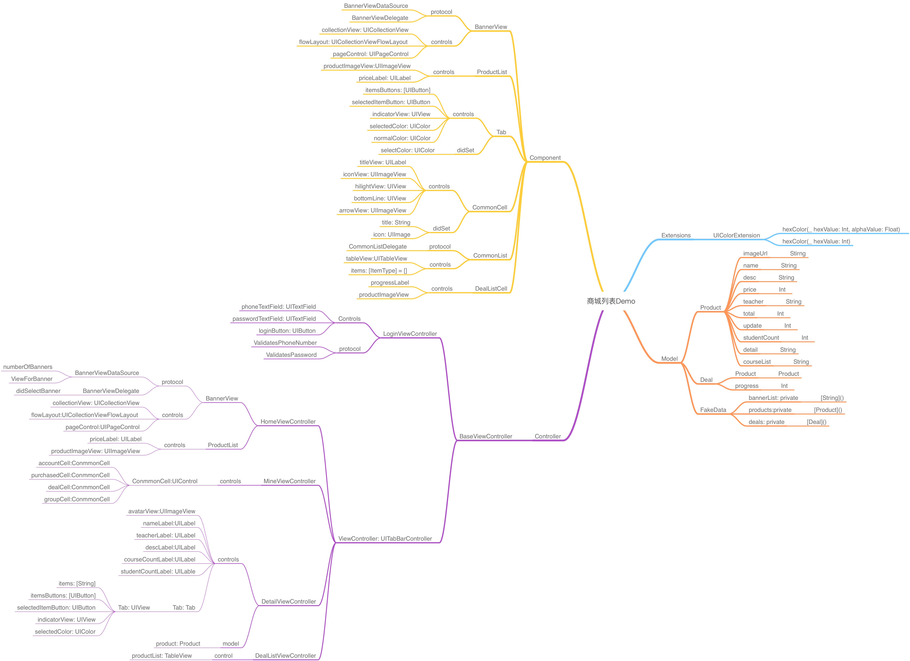

# Swift-iOS-demo
通过swift编写的一些iOSdemo

## Calculator-Demo

计算器Demo

## Swift-Circle

设置圆角

## Swift通过协议传值

Swift通过协议传值

## obj-calculate

面向对象写法计算器Demo

## store-demo

极客商城-Demo

## UICollectionView-拖拽

iOS11版本后的UICollectionView-拖拽

## SwiftUI

### SwiftUI-CornerRadius

swiftUI设置不规则的圆角

### SwiftUI-ListAndLink

swiftUI 列表和跳转

### Swift-List-Regular-Waterfall-Flow-Demo

SwiftUI 规则瀑布流布局

### SwiftUI-Geometry-Demo

SwiftUI-Geometry布局Demo

### Static-Model-Demo

Swift弹窗组件

### SwiftUI-NavigationView-Demo

swiftUI 设置导航部分的Demo